# Object Detection R-CNN

This repository follows the steps from [PyImageSearch](https://pyimagesearch.com/2020/06/22/turning-any-cnn-image-classifier-into-an-object-detector-with-keras-tensorflow-and-opencv/) to implement a simple R-CNN architecture and learn different object detection techniques and architectures such as image pyramids, sliding windows, non-maximum suppression, selective search, ResNet50 or R-CNN. 


## 1. Classifier to object detection

Script `v1_classifier_to_object_detection.py` takes an image classifier (i.e., ResNet50, preloaded with imagenet weights) and turns it into an object detector. This is done with a classic ML implementation of an **image pyramid** and **sliding window** to detect objects, and **NMS (non-maximum suppressor)** to reduce the overlaying ROIs with less probability. 

We achieve the following predictions:

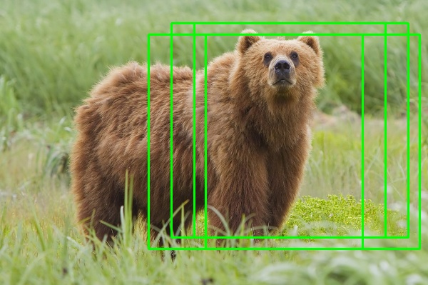

And here's the result after applying NMS:

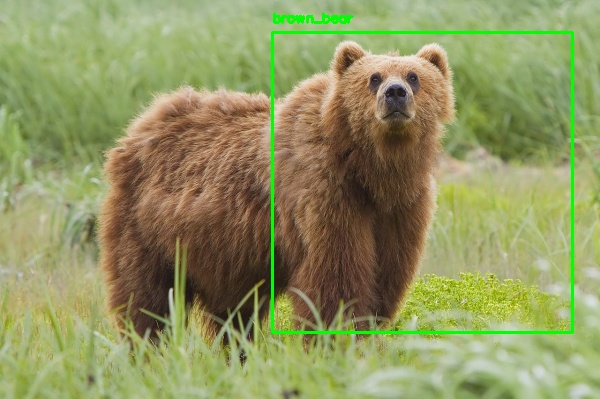

## 2. Selective search

Script `v2_selective_search.py` is used to understand the use of Selective Search with OpenCV, which is used to automatically identify locations in an image that could contain an object through region proposals. It is far more computationally efficient than computing image pyramids and sliding windows. Here's the result of applying selective search:

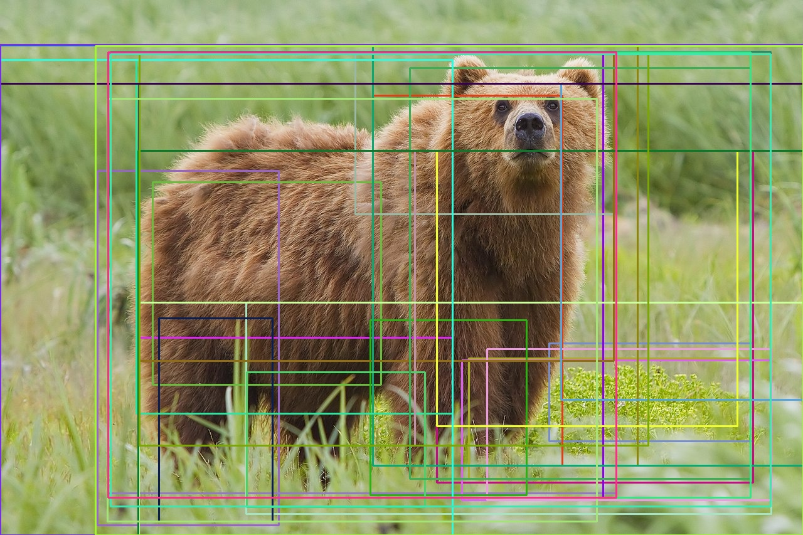


## 3. Region proposal detection

After the previous study of selective search, the resulting boxes are feed into the same ResNet50 classifier. We achieve the following predictions:

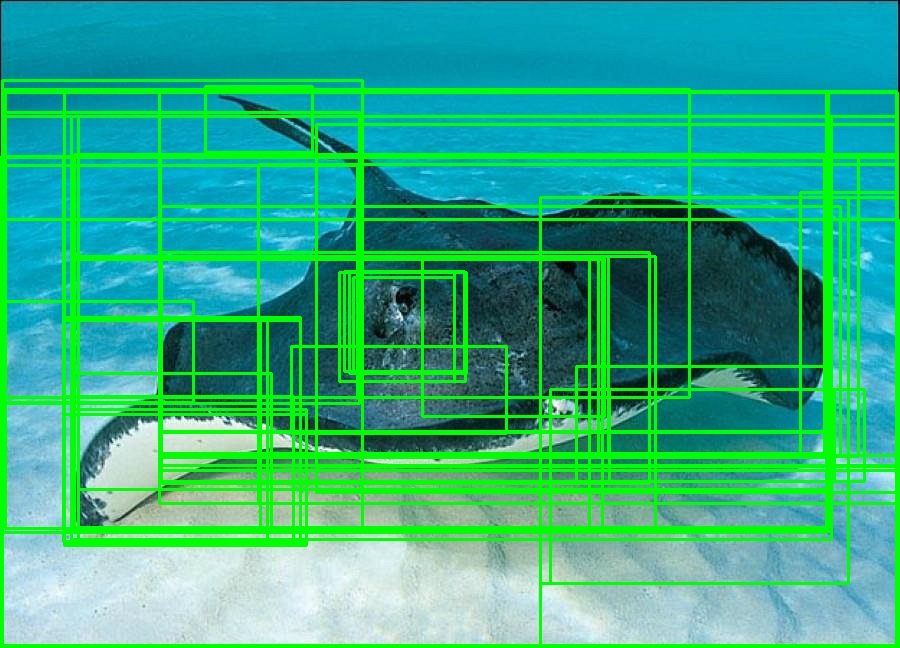

And here's the result after applying NMS:

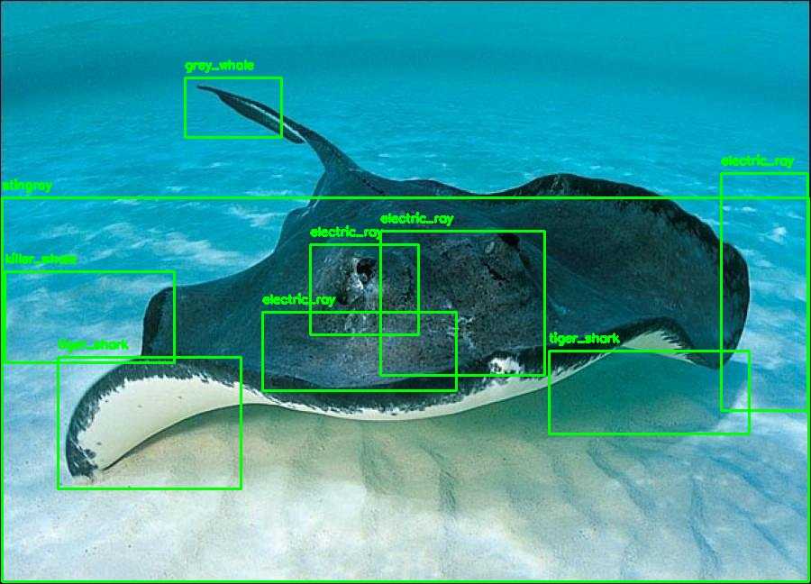


## 4. Raccoon detection with R-CNN

In this final step, we train an R-CNN object detector to detect raccoons in input images. The [dataset](https://github.com/datitran/raccoon_dataset) contains 200 images with 217 total raccoons, as some images contain more than one raccoon.

First, we create the following project structure:
```
├── images
│   ├── plot.png
│   ├── dataset
│   │   ├── no_raccoon [2200 entries]
│   │   └── raccoon [1549 entries]
│   ├── raccoons
│   │   ├── annotations [200 entries]
│   │   └── images [200 entries]
│   └── ...
├── helpers
│   ├── __init__.py
│   ├── config.py
│   ├── iou.py
│   └── ...
├── v4_build_dataset.py
├── v4_fine_tune_rcnn.py
├── v4_detect_object_rcnn.py
├── label_encoder.pickle
├── raccoon_detector.h5
└── ...
```

- `v4_build_dataset.py` takes the images and annotations in the `raccoons/` directory and creates a separate `raccoon` / `no_raccoon` dataset, used to fine-tune a MobileNet V2 model that is pre-trained on ImageNet.
- `v4_fine_tune_rcnn.py` fine-tunes with our `raccoon` / `no_raccoon` dataset.
- `v4_detect_object_rcnn.py` performs a simple R-CNN object detection through Selective Search and a classification model.
- We use the IoU metric (`helpers/iou.py`) to measure the accuracy of the predictions (in comparison to the ground truth boxes).

### 4.1. Dataset generation
We generate a new dataset through selective search for the CNN to learn the images just like they will be processed on inference (i.e., through selective search). If we would train it directly with the ground-truth boxes, the trained CNN would not generalize to other ROIs. This means that some of the resultant images are similar to each other and in some cases are near-duplicates — that is the intended behaviour. It’s feasible that Selective Search could fire multiple times in similar regions. That said, we could add additional logic that can be used to filter out regions that significantly overlap. Here are the results of this new dataset:

*Raccoons*:
<p float="left">
    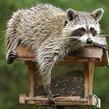
    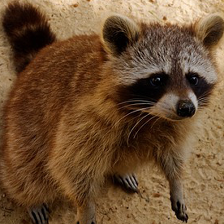
    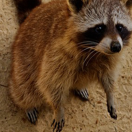
    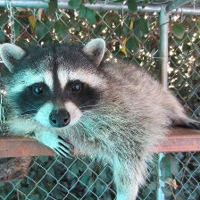
    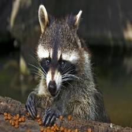
    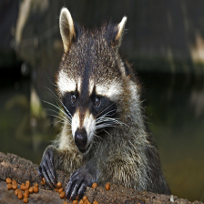
</p>

*No raccoons*:
<p float="left">
    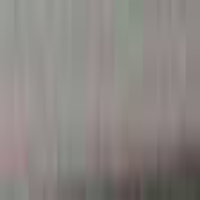
    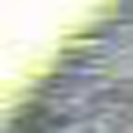
    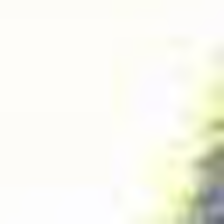
    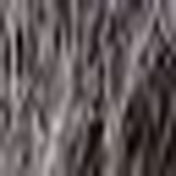
    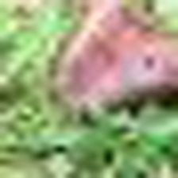
    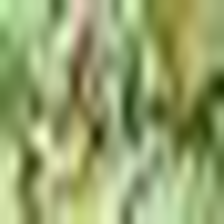
</p>

### 4.2. Fine-tune MobileNet V2

We split the dataset with 75% training and 25% for testing. Additionally, we apply data augmentation options. The MobileNet V2 architecture is frozen and we define and train the top layers for fine-tuning:

- Average Pooling 2D (7,7)
- Flatten
- Dense (128, ReLU activation)
- Dropout (0.5)
- Dense (2, Softmax activation)

We train the model through the binary crossentropy loss. And finally, we save the model to `raccoon_detector.h5` and the label encoder to `label_encoder.pickle`. Here's the loss and accuracy plot:

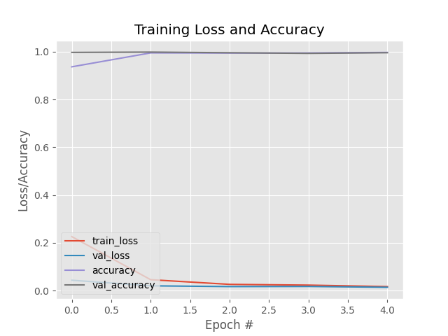


### 4.3. R-CNN object detection inference

This final script implements the inference process with a primitive object detection network (RCNN) composed of three main steps:
1. Selective Search is applied to the input image to get region proposals
2. The region proposals are fed to the previously trained model which classifies the images.
3. Apply NMS to the regions classified as positive predictions. 

Here's an example result before NMS:

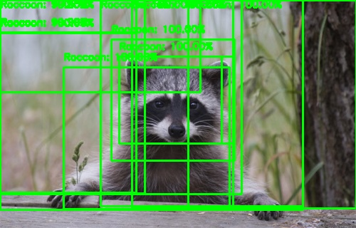

And here's the result after applying NMS:

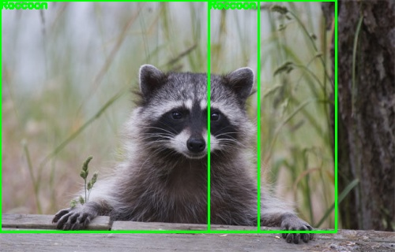

